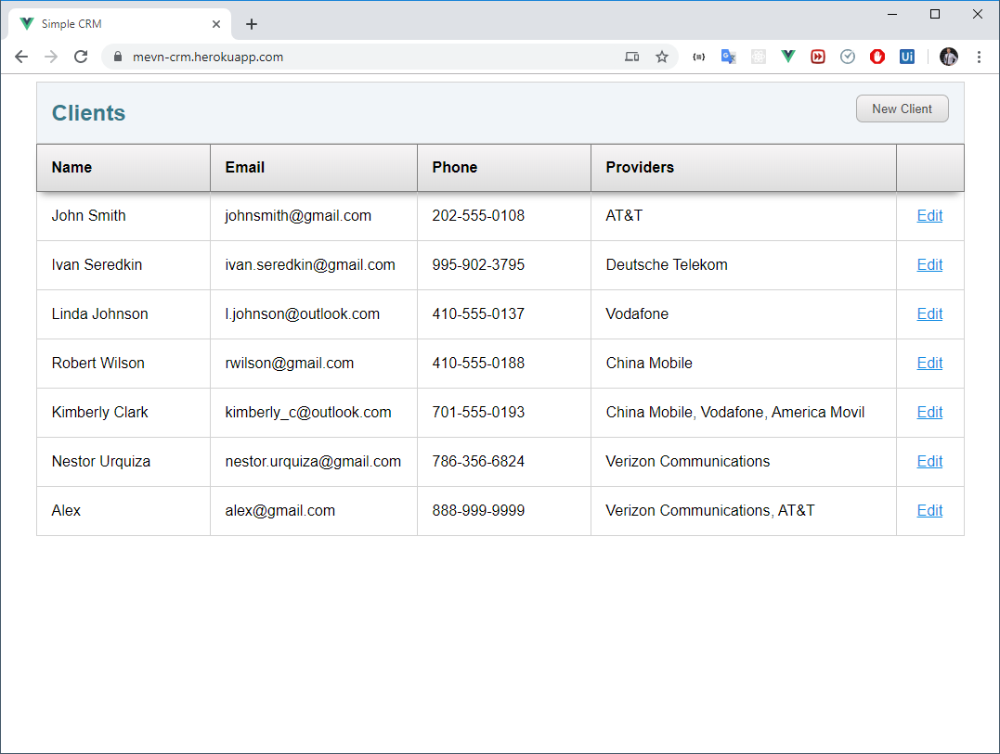

# Simple MEVN CRM Example



Example of a fullstack app using MongoDB, Express, Vue.js 2, Node.js (MEVN) and Swagger.

You will need to edit the MongoDB connection string in server/app.js to your own.

Ready to deploy on Heroku.

Demo: https://mevn-crm.herokuapp.com/

Swagger: https://mevn-crm.herokuapp.com/api-docs

## Quick Start

```bash
# Install dependencies
npm install

# Start Express Server: http://localhost:5000
npm start

# Start Vue DevServer: http://localhost:8080
cd client
npm run serve

# Build for production (Will build into server/public, ready for deployment)
cd client
npm run build

# Swagger url Vue DevServer: http://localhost:5000/api-docs
```

## Author

[Ivan Seredkin](https://www.facebook.com/ivan.seredkin)
